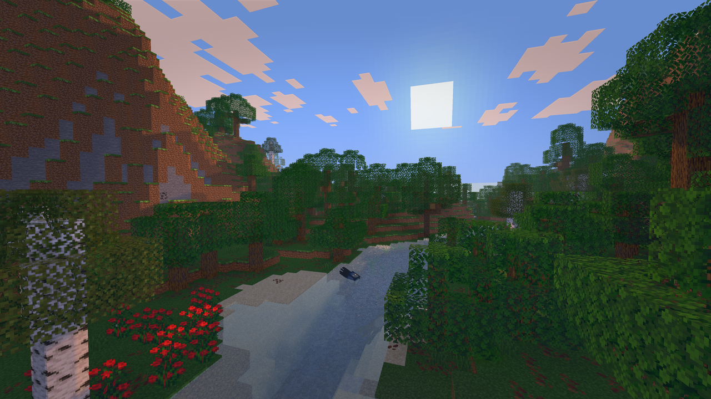
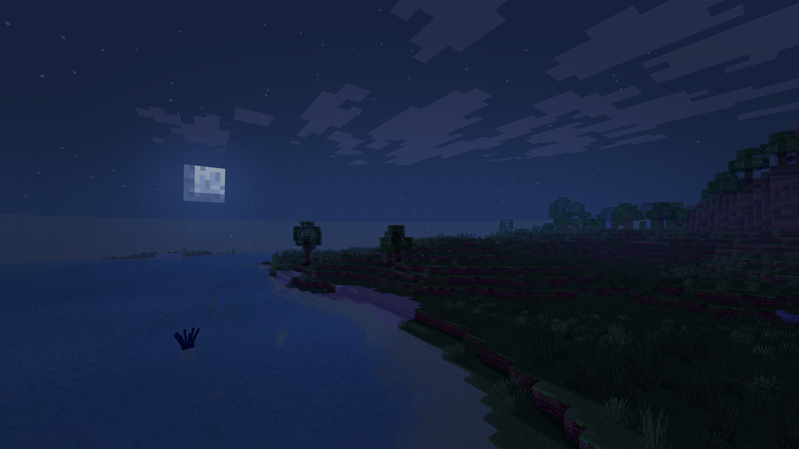
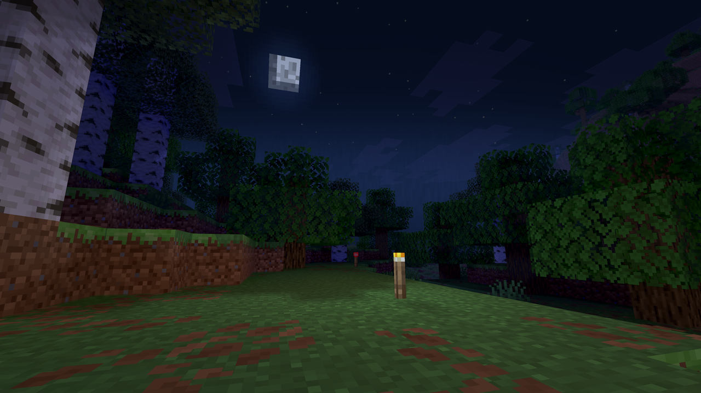
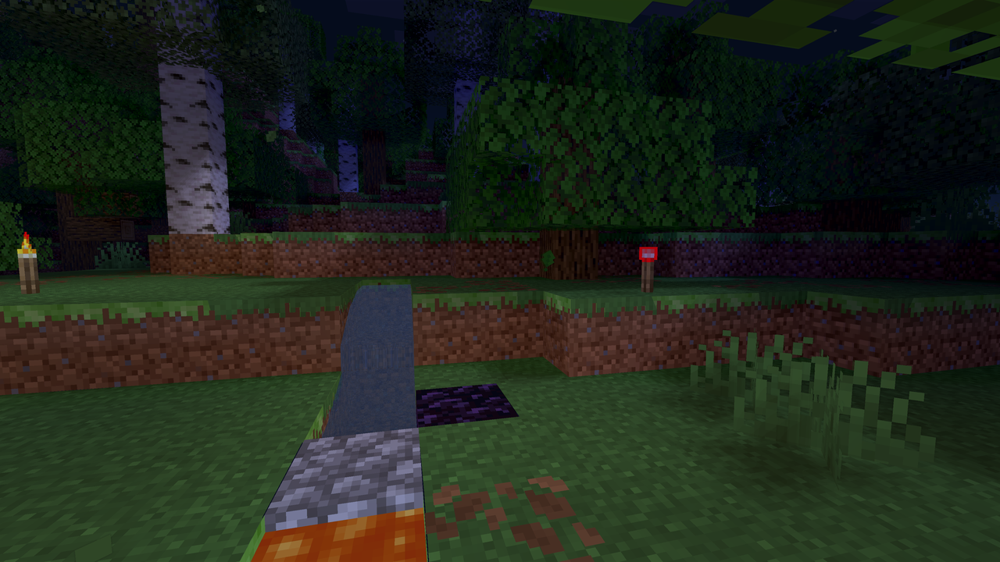

# Client GLSL Shaderpack Lab

[한국어 README](README.ko.md)

Minimal Iris/OptiFine-style GLSL shaderpack experiment for Minecraft Java.

This is a vibe-coded shader: an iterative visual lab focused on quickly shaping mood, water, light, and atmosphere in-game.

This project is intentionally separate from the server-side Fabric optimizer code.

## Preview

In-game Iris test captures from the current shaderpack build:

| Night water and moon haze | Torch and local lighting |
| --- | --- |
|  |  |

| Material and local light test |
| --- |
|  |

## What This First Version Does

- Runs as a standard shaderpack folder or zip.
- Uses resource pack format 15 for Minecraft Java 1.20.1.
- Uses `shadow`, `composite`, multi-pass bloom, and `final` passes for low-risk visual iteration.
- Adds screen-space shadowing from the shadow map.
- Adds a water mask pass for dusk-styled glossy water reflections.
- Reads LabPBR `_n.png` and `_s.png` atlases from the active resource pack through Iris/OptiFine `normals` and `specular` samplers.
- Encodes material targets for water, smoothness, emissive strength, porosity, PBR view normals, material AO, reflectance, height, and upward-facing surfaces.
- Shader settings are defined in `shaders/shaders.properties`.
- Adds rain/wetness-based puddle reflection and ripple highlights.
- Rain weather now models an overcast cloud layer: direct sun transmission, sun-path water sparkle, caustics, god rays, cloud rim light, and shadow contrast fade under rain while cool diffuse skylight and mist rise.
- Adds PBR-aware specular response, wet surface polish, emissive glow, material AO, normal-driven fresnel, porosity rain damping, and roughness contrast controls.
- Removes the older HBAO and screen-space ray AO paths; dynamic ambient occlusion now uses SSAO only to reduce moving-view shimmer.
- Water now combines reflection, depth absorption, shallow-water clarity, and weak refraction distortion so the surface reads as reflective without turning into a screen mirror.
- Adds a dedicated `composite6` reflected-geometry resolve pass. Water pixels now trace visible terrain/tree geometry into `colortex8`, then the final pass blends that texture back onto the surface for a more grounded reflected-geometry read than the older single-pass post reflection.
- Water defaults are tuned darker than the previous test build: surface brightness is reduced, ambient sky reflection is damped, only sun-direction specular is boosted, far water loses high-frequency noise, and near water keeps detail.
- Noon water no longer crushes midtones: daylight highlight rolloff now affects only bright glints, and `WATER_NOON_VISIBILITY_FLOOR` keeps deep water readable blue instead of black.
- Water color now moves by depth: shallow water trends cyan-white, deep water trends cyan-blue.
- Water now adds a directional sun path, shallow sand-color return, and weak near-shore caustic shimmer so highlights cluster toward the real sun direction instead of spreading evenly over the whole surface.
- Fog now blends sky and water color instead of leaning into a flat gray wall; volumetric fog density/blue tint are restrained by default to avoid the washed-out blue-gray look seen in distant rainy or ocean views.
- Horizon blending has a dedicated water-sky mist pass to soften the flat gray render-boundary band where distant water, fog, and sky meet.
- Vanilla cloud geometry now writes a cloud marker into the material buffer, allowing the composite pass to add density variation, inner shadow, and sun-behind-cloud scattering without changing world geometry.
- Glass and high-reflectance metal surfaces use PBR smoothness/reflectance plus Fresnel to add a restrained cyberpunk cyan/magenta reflection split.
- Leaf-tinted terrain gets a stronger natural green response plus a subtle vertex sway for wind-like movement.
- The main scene and bloom buffers now stay in a precise `0..1` LDR range with 16-bit normalized color targets instead of carrying overbright HDR values.
- The final pass uses an LDR precision curve for shadow toe, highlight shoulder, low-black-floor detail, and local contrast preservation without 20-stop HDR compression.
- Default final color grading now favors physically plausible exposure over stylized filters: pastel wash, BF3-style blue grading, heavy rain gray-blue tint, and over-bright middle-gray mapping are reduced or disabled by default.
- Sunlight tint keeps its brightness but defaults to 35% lower daylight saturation through `SUNLIGHT_SATURATION`, reducing over-yellow sand, cloud scatter, and water glints.
- Adds color grading, contrast, vignette, and underwater tint handling.
- Adds real multi-stage bloom: bright extraction in `composite1`, downsample blur through `composite2`/`composite3`, upsample accumulation through `composite4`/`composite5`, and final compositing from `colortex5`.
- Bloom defaults use a higher threshold, restrained pixel radius, soft knee, rain/night damping, and dim-surface guarding so rainy, nighttime, and indoor scenes do not smear every bright surface.
- Bloom extraction now follows a more physical viewing model: local eye adaptation, source-to-surround contrast, emission, muted sky glare, and broad bright-surface suppression decide what scatters instead of treating saturated color as light.
- Final bloom compositing now behaves more like lens/atmospheric veiling glare, with exposure-aware damping before adding colored scatter back into the image.
- Adds first-pass screen-space RT local lighting for torch-like emissive sources: visible warm emissive pixels cast local colored light, trace through the depth buffer, and reduce light where intervening geometry blocks the ray.
- RT local light settings are exposed as `RT_LOCAL_LIGHT_STRENGTH`, `RT_LOCAL_SHADOW_STRENGTH`, `RT_LOCAL_SCREEN_RADIUS`, `RT_LOCAL_MAX_DISTANCE`, `RT_LOCAL_TRACE_STEPS`, `RT_LOCAL_SOURCE_THRESHOLD`, and `RT_LOCAL_WARMTH`.
- RT local lights get a small weather contrast response through `RT_WEATHER_LOCAL_CONTRAST`, so torch-like sources stand out more when rain clouds cut daylight.
- RT source detection now uses a stricter warm-texture source mask so ordinary torch-lit walls are less likely to become fake emitters.
- Adds a block-light field fallback in the material mask: non-water surfaces encode local block light below the water-mask threshold, then composite uses it for stable warm local light and shadow-edge darkening even when the torch itself is off screen.
- Adds Iris shader profiles for `low`, `balanced`, and `cinematic`. `balanced` matches the current shader defaults, while the other two profiles lower or raise the same setting groups for direct in-game comparison.
- Current RT limitation: visible emissive sources use screen-space tracing, while the block-light fallback is a stable light-field approximation rather than a full voxel light list.
- Current water reflection limitation: the new reflection texture is a half-resolution Iris pass for visible reflected geometry. It is still bounded by screen/depth-buffer visibility, not a full second mirrored world render, which keeps performance closer to this lab pack's current budget.
- Keeps the shader simple enough to debug with Iris shader reload.

## Install

1. Run `package_shaderpack.bat`.
2. Copy `dist/Client-GLSL-Shaderpack-Lab-1.20.1.zip` into `.minecraft/shaderpacks/`.
3. Enable it from Iris or OptiFine shader settings.

During development, you can also copy this folder directly into `shaderpacks/` and reload shaders in-game.

## Iris Profile Comparison

Open Iris shader settings and use the profile button at the top of the main options screen.

- `low`: reduces expensive comparison targets first. It drops shadow map resolution/distance, SSAO radius and strength, RT local light tracing distance/steps, bloom radius/GI, water SSR steps/distance, rain SSR, fog/cloud intensity, leaf wind, and reflective glass/metal response. It also disables the `composite6` reflected-geometry water pass and sets its final blend to `0.00`.
- `balanced`: preserves the values that were already in the shader sources before this profile pass. Use this as the baseline when checking whether `low` or `cinematic` changed a scene too much.
- `cinematic`: raises the same groups for visual stress testing. It uses 4096 shadows at 160 blocks, stronger SSAO, longer RT local light tracing, larger bloom/GI, longer water SSR and reflected-geometry tracing, stronger fog/cloud/rain atmosphere, more water motion, stronger material reflections, and stronger leaf movement.

Suggested test loop:

1. Select `balanced`, reload shaders, and take a baseline view over water, trees, torch-lit blocks, rain, and glass/metal/PBR surfaces.
2. Switch to `low`, reload shaders, and check for retained scene readability with lower reflection, AO, bloom, shadow, and local-light cost.
3. Switch to `cinematic`, reload shaders, and check whether the larger shadow range, water reflection pass, bloom GI, and weather atmosphere are worth the heavier load.
4. If you touch an individual slider after selecting a profile, Iris may show `Custom`; reselect the profile to return to the preset.

## Next Targets

- Tune against `vanilla-pbr-map-maker/dist/Vanilla-PBR-Generated.zip` with Iris and the shaderpack enabled together.
- Add parallax/POM once height-map behavior is verified in-game.
